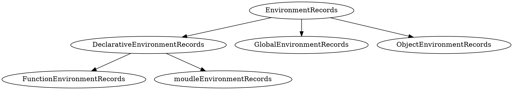

# JS结构化 ｜ JS 函数调用
> 微任务中函数调用会影响内部的执行顺序。

##函数调用
> 函数调用：可以通过栈来描述

* Execution Content Stack (执行上下文栈)
  多个函数调用最终形成的结构

* Running Execution Context (正在运行执行上下文)
  也就是每个函数调用时，压入栈的上下文。
  

###Execution Content 
组成
* code evaluation state :记录执行到哪里
* function
* script module
* generator
* Realm：内置对象集合
* LexicalEnvironment
* VariableEnvironment


####LexicalEnvironment

存储内容
* this
* new.target
* super
* 变量
    

####VariableEnvironment
处理历史遗留问题

处理`var`声明
`eval()`中声明的`var`无法预处理
`with()`中射门变量会提升到`with`所在函数

###Environment record

组成结构



###Function - Closure
> js 每个函数都会生成一个闭包。
     
组成：
* 代码：object + code
* 环境：EnvironmentRecords


```j
// EnvironmentRecords 捕获变量 z 、y 和尖头函数 this 指向 global 
var y = 2;
function foo2(){
    var z = 3;
    return () => {
        // code 
        console.log(y,z)
    }
}
var foo3 = foo2();
export foo3;
```

### Realm
> 记录了`JavaScript`引擎实例中所有的内置对象。
> Realm 彼此之间是独立的。
 
使用场景
```j
// 直接量声明
var x = {};
var y = [];
var h = "";
 
// . 运算符做隐式转换
1.toString();
```