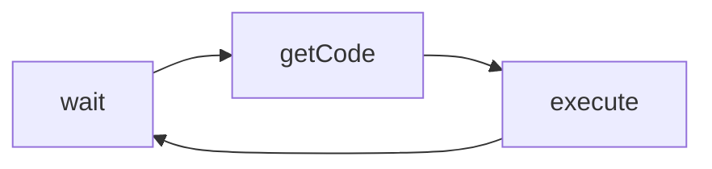

# JS 结构化 ｜ 宏任务和微任务

##JS 执行粒度（运行时）

>关系：自上而下的包含关系
* 宏任务：传给JS引擎任务
* 微任务：Promise 产生
* 函数调用
* 语句、声明
* 表达式
* 直接量、变量、this

###宏任务和微任务
* 宏任务
    交给 js引擎 执行的任务。

* 微任务
    js 中只有`promise`会产生微任务。写在宏任务内部。
    
    
    
##事件循环

组成
* 等待
* 获取代码
* 执行代码

