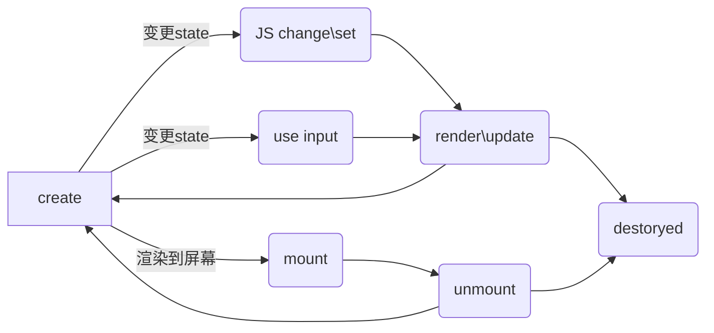

# 1. 组件的基本知识 | 组件的基本概念和基本组成部分

> 对`html`标签进行扩展以达到复用的目的。

## 对象组件

对象：
* property
* methods
* inherit：原型基础


组件：类似特殊的对象和特殊的模块。可以以树型结构进行存储，并且有模版化的功能。
* property：属性
* methods
* inherit：原型基础
--------------------
* attribute：个性
* config & state
* event
* lifecycle
* children：树型结构（子组件）

## attribute
* attribute： 强调描述
* property：强调从属关系

### js中设置 html 属性

* attribute

```js
<my-Component attribute="v">
myComponent.getAttribute("a");
myComponent.setAttribute("a","value")
```

* property

```js
myComponent.a = "value"
```

### 早年 html `class` 属性和 js 中`className` 相互对应

```ht
<div class="class1 class2"></div>
<script>
    vat div = document.getElementByTagName('div');
    div.className // class1 class2
</script>
```

### 字符串 和 对象

```js
// html 标签中`style` attribute
<div style="height: 10px"><div>

// 获取style对象
<script>
var div = document.getElementByTagName("div");
div.style // {height: '10px'}
<script>

```

### href 

```ht
<a href="//m.taobao.com">
<script>
    let a = douement.getElementByTagName("a");
    a.href // 经过 resolve 处理的URL：http://m.taobao.com
    a.getAttribute("href") // m.taobao.com
</script>
```

### input 中 value 属性

* attribute：作为`input`的默认值存在
* property：对`value`的修改不会影响`attribute`。

```js
var input = document.getElementByTagName(‘input’); // 若 property 没有设置， 则结果是 attribute
input.value // cute
input.getAttribute(‘value’); // cute
input.value = ‘hello’; // 若 value 属性已经设置，则 attribute 不变，property 变化， 元素上实际的效果是 property 优先
input.value // hello
input.getAttribute(‘value’); // cute
```

## 如果设计组件的状态


| Markup set | JS set | JS change | User Input change |           |
|:----------:|:------:|:---------:|:-----------------:|:---------:|
| ❌          | 对勾     | ✅         | ？                 | Property  |
| ✅          | ✅      | ✅         | ？                 | Attribute |
| ❌          | ❌      | ❌         | ✅                 | State     |
| ❌          | ✅      | ❌         | ❌                 | Config    |


## 生命周期





## Children
* content children：作为内容显示，和传入内容一致。
* template children：作为模版，根据渲染需要

# 2. 组件的基本知识 | 为组件添加JSX语法

## 搭建jsx 环境
* webpack
    * webpack-cli
    * babel-loader
    * webpack-dev-server 

* babel：新版本js转化为老版本的js
    * @babel/core ：babel 依赖
    * @babel/preset-env ：babel 依赖
    * @babel/plugin-transform-react-jsx ： 解析 jsx ，统一调用 React.createElement()

    
```js
module.exports = {
    entry: './main.js', // 入口
    module:{
        rules:[ // 配置模块打包规则
            {
                test: /\.js$/, //匹配文件
                use: { // 配置loader
                    loader: 'babel-loader', // loser 名称
                    options:{
                        presets: ['@babel/preset-env'], // 依赖
                        //pragma 配置 jsx 解析后需要调用方法
                        plugins: [['@babel/plugin-transform-react-jsx', {pragma: "createElement"}]] 
                    }
                }
            }
        ]
    },
    devServer:{
        contentBase: './' //本地服务提供资源路径
    },
    mode: "development" // 开发模式不开启代码压缩
}
```

# 3. 组件的基本知识 | JSX的基本使用方法
>jsx中会把`html`编写的部分通过转化为`createElement()`函数调用。

* crateElement 函数参数
    * type：DOM元素类型
    * attributes：标签属性
    * ...children：标签子元素（递归调用`createElement`）

* crateElement 返回值
    * DOM 元素

* 函数调用过程
1. 通过类型判断创建元素类型
2. 设置属性
3. 设置子元素
4. 返回 DOM 元素

    
## 分装不同类型元素
    
```js
// 将普通标签转化为 class 
class ElementWrapper{
    constructor(type){
        this.root = document.createElement(type);
    }
    mountTo(parent) {
        parent.appendChild(this.root);
    }
    setAttribute(name, value) {
        this.root.setAttribute(name, value);
    }
    appendChild(child){
        // 反向设置
        child.mountTo(this.root);
    }
}
// 包装文本
class TextWrapper{
    constructor(child){
        this.root = document.createTextNode(child);
    }
    mountTo(parent) {
        parent.appendChild(this.root);
    }
    setAttribute(name, value) {
        this.root.setAttribute(name, value);
    }
    appendChild(child){
        // 反向设置
        child.mountTo(this.root);
    }
}
```

# 4. 轮播组件 | 轮播组件（一）

1、将`JSX`功能提取为，可以供外部调用的模块。

```js
/**
 * 创建真实 DOM
 * @param {*} type DOM 类型 
 * @param {*} attributes 属性列表
 * @param  {...any} children 子元素
 */
export function createElement(type, attributes, ...children) {
    // 创建 Node
    let element = "";
    if (typeof type === 'string') {
        element = new ElementWrapper(type);
    } else {// 非字符串类型会被识别为 class
        element = new type;
    }

    // 添加属性
    for (let name in attributes) {
        element.setAttribute(name, attributes[name]);
    }
    // 添加子元素
    for (let child of children) {
        if (typeof child === 'string') {
            child = new TextWrapper(child);
        }
        element.appendChild(child);
    }
    return element;
}

// 提取公共基础组件类 
export class Component {
    constructor(child){
    }

    mountTo(parent) {
        parent.appendChild(this.root);
    }
    setAttribute(name, value) {
        this.root.setAttribute(name, value);
    }
    appendChild(child){
        // 反向设置
        child.mountTo(this.root);
    }
}

// 将普通标签转化为 class 
class ElementWrapper extends Component {
    constructor(type){
        this.root = document.createElement(type);
    }

}
// 包装文本
class TextWrapper extends Component {
    constructor(child){
        this.root = document.createTextNode(child);
    }

}
```

2、创建`Carousel`组件继承于`Component`，实现从属性拿到数据，并渲染到`DOM`上。

```js
import { Component, createElement } from './framework';

class Carousel extends Component {
    constructor(){
        super();
        // 存储属性
        this.attributes = Object.create(null);
    }
    // 重写拿到属性值
    setAttribute(name, value){
        this.attributes[name] = value;
    }
    // 创建轮播图 DOM
    render(){
        console.log(this.attributes.src);
        this.root = document.createElement('div');
        for (let record of this.attributes.src) {
            let child = document.createElement('img');
            child.src = record;
            this.root.appendChild(child);
        }

        return this.root;
    }
    mountTo(parent){
        parent.appendChild(this.render())
    }
}
const d = [
    'https://static001.geekbang.org/resource/image/bb/21/bb38fb7c1073eaee1755f81131f11d21.jpg',
    'https://static001.geekbang.org/resource/image/1b/21/1b809d9a2bdf3ecc481322d7c9223c21.jpg',
    'https://static001.geekbang.org/resource/image/b6/4f/b6d65b2f12646a9fd6b8cb2b020d754f.jpg',
    'https://static001.geekbang.org/resource/image/73/e4/730ea9c393def7975deceb48b3eb6fe4.jpg'
]
let a  = <Carousel src={d} />
a.mountTo(document.body);
```

# 5. 轮播组件 | 轮播组件（二）

1、添加样式

```css
/* 同一时刻只显示一个图片 */
    .carousel{
        overflow: hidden; 
        width: 500px;
        height: 280px;
        white-space: nowrap;
    }
    .carousel>div{
        width: 500px;
        height: 280px;
        background-size: contain;
        display: inline-block;
        transition: ease 0.5s;
    }
```

2、实现自动轮播效果

```js
    let currentIndex = 0;
    setInterval(() => {
        let children = this.root.children;
        let nextIndex = (currentIndex + 1) % children.length; // 取余循环轮播
        // 取出前后两张
        let current = children[currentIndex];
        let next = children[nextIndex];

        // 修改下一张位置
        next.style.transition = "none"; //关闭动画
        next.style.transform = `translateX(${100 - nextIndex * 100}%)`;

        setTimeout(() => { // 延时一帧防止覆盖
            next.style.transition = ""; // 让 css 动画生效
            current.style.transform = `translateX(${-100 - currentIndex * 100}%)`;
            next.style.transform = `translateX(${- nextIndex * 100}%)`;

            // 交换当前位置
            currentIndex = nextIndex;
        }, 16);


        for (let child of children) {
            child.style.transform = `translateX(-${100* current}%)`;
        }


    }, 3000);
```

3、实现鼠标拖动


```js
// down => move => up 按顺序执行一组事件
this.root.addEventListener('mousedown', event => {
    console.log('mousedown')

    let move = event => {
        console.log('mousemove');
    

    }
    let up = () => {
        console.log('mouseup');
        // 移除监听，保证事件按顺序执行
        document.removeEventListener('mousemove', move);
        document.removeEventListener('mouseup', up);

    }
    
    // document 扩大范围即使在浏览器之外
    document.addEventListener('mousemove', move);
    document.addEventListener('mouseup', up);
})
```


# 6. 轮播组件 | 轮播组件（三）

1. 处理鼠标移动图片位置变化


```js
let move = event => {
        console.log('mousemove');
        // 移动位置
        let x = event.clientX - startX;

        // 当前位置(保留符号取余)
        let current = position - ((x - x % 500) / 500);

        // 当前图片前一后后一个位置,支持左右拖动
        for (let offset of [-1, 0, 1]) {
            let pos = current + offset;
            // 防止变为负数
            pos = (pos + children.length) % children.length;
            // 去掉动画
            children[pos].style.transition = 'none';
            // position * 500 挪到第二张的位置
            children[pos].style.transform = `translateX(${- pos * 500 + offset * 500 + x % 500}px)`;
        }


    }
```


1. 处理捡起位置和拖动一半的位置

```js
let up = event => {
            console.log('mouseup');
            let x = event.clientX - startX;
            // 拖动一半后更新位置
            position = position - Math.round(x / 500);
            // 抬起时记录上次位置。
            for (let child of children) {
                child.style.transition = '';
                // position * 500 挪到第二张的位置
                child.style.transform = `translateX(${- position * 500 }px)`;
            }

            // 移除监听，保证事件按顺序执行
            document.removeEventListener('mousemove', move);
            document.removeEventListener('mouseup', up);

        }
```

# 6. 轮播组件 | 轮播组件（四）

实现手动轮播的循环拖动

```js
let move = event => {
    console.log('mousemove');
    // 移动位置
    let x = event.clientX - startX;

    // 当前位置(保留符号取余)
    let current = position - ((x - x % 500) / 500);

    // 当前图片前一后后一个位置,支持左右拖动
    for (let offset of [-1, 0, 1]) {
        let pos = current + offset;
        // 防止变为负数
        pos = (pos + children.length) % children.length;
        // 去掉动画
        children[pos].style.transition = 'none';
        // position * 500 挪到第二张的位置
        children[pos].style.transform = `translateX(${- pos * 500 + offset * 500 + x % 500}px)`;
    }


}
let up = event => {
    console.log('mouseup');
    let x = event.clientX - startX;
    // 拖动一半后更新位置
    position = position - Math.round(x / 500);


    // Math.round(x / 500)：滚动方向
    // 250 * Math.sign(x)：是否超过一半
    for (let offset of [0, - Math.sign(Math.round(x / 500) - x + 250 * Math.sign(x))]) {
        let pos = position + offset;
        // 防止变为负数
        pos = (pos + children.length) % children.length;
        // 去掉动画
        children[pos].style.transition = 'none';
        // position * 500 挪到第二张的位置
        children[pos].style.transform = `translateX(${- pos * 500 + offset * 500}px)`;
    }


    // 移除监听，保证事件按顺序执行
    document.removeEventListener('mousemove', move);
    document.removeEventListener('mouseup', up);

}
```